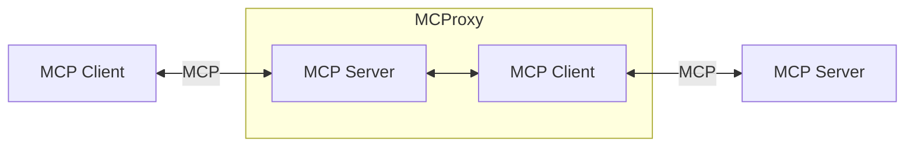
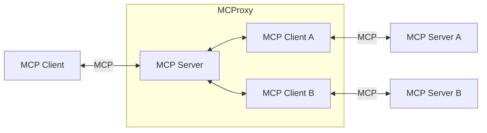
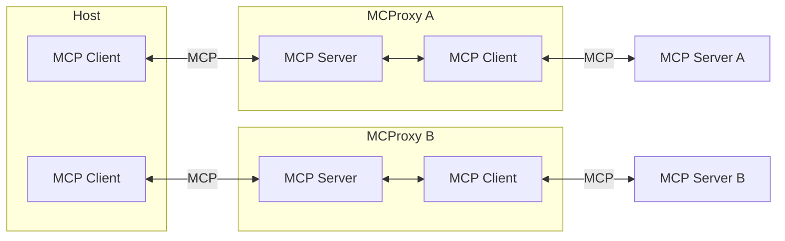
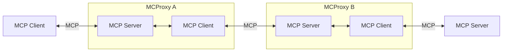

# Foreword

Discussion

# Overview

This project is related to Anthropic's Model Context Protocol (MCP, see [docs](https://modelcontextprotocol.io) and [spec](https://spec.modelcontextprotocol.io/)).

MCProxy is a proxy between MCP Clients and MCP Servers, introducing new features in the workflow between them (a few examples are given below).

# Global architecture

From a Client's perspective, MCProxy behaves like a Server.
From a Server's perspective, MCProxy behaves like a Client.

In its simplest form:

A MCProxy can connect to multiple servers:

A MCP Host may connect to different MCProxies with very different configurations:

If of any use, MCProxies can be chained:

# Internal architecture

# Features

Here are a few examples of features an MCProxy could implement.

## Logging

An MCProxy can log all messages going back and forth between an MCP Client and an MCP Server.

## Capabilities aggregation

An MCProxy can aggregate capabilities from different servers into a meaningful package.

## Capabilities blocking

An MCProxy may expose only a subset of the capabilities provided by the server(s) it connects to.

## Capabilities disambiguation

With the fast-growing number of servers, me might end up with some name collisions. An MCProxy may rename capabilities, so that they appear unique to a client, and handle routing to the appropriate server.
