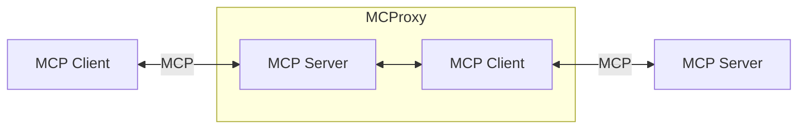
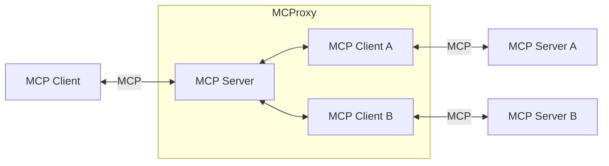
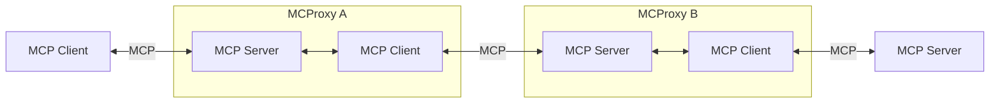

# Foreword

Discussion

# Overview

This project is related to Anthropic's Model Context Protocol (MCP, see [docs](https://modelcontextprotocol.io) and [spec](https://spec.modelcontextprotocol.io/)).

MCProxy is a proxy between MCP Clients and MCP Servers, introducing new features in the workflow between them (a few examples are given below).

# Global architecture

From a Client's perspective, MCProxy behaves like a server.
From a Server's perspective, MCProxy behaves like a client.

In its simplest form:

A MCProxy can connect to multiple servers:

If of any use, MCProxies can be chained:

